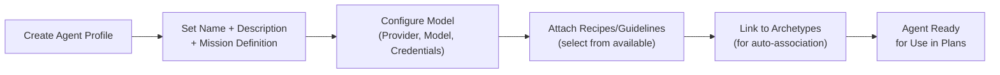
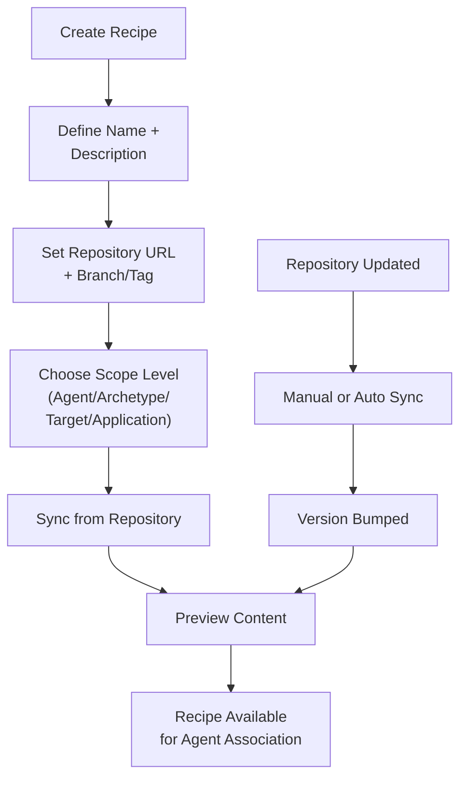
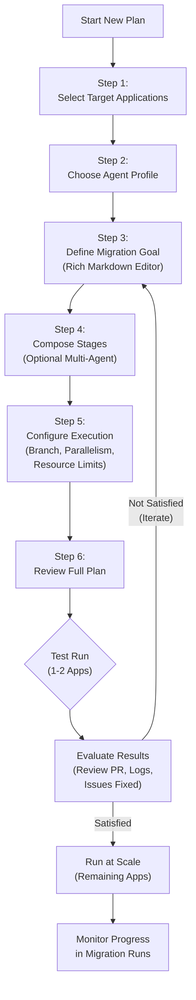
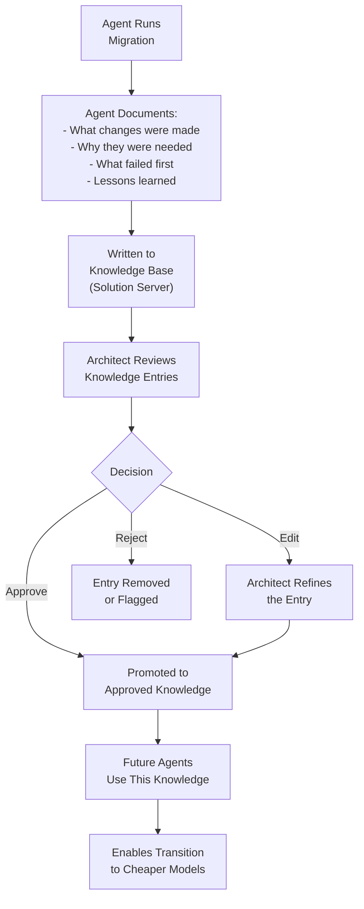
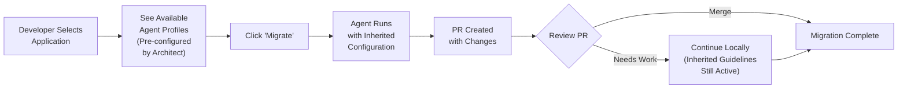
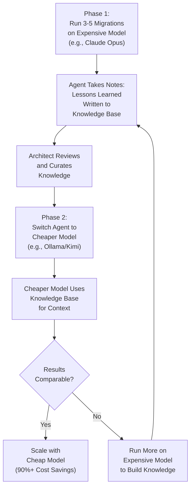

# Agentic Migration UX Specification

## 1. Executive Summary

MTA (Migration Toolkit for Applications) is expanding to support **enterprise-scale agentic migrations**. This document defines the UX for a system where **Enterprise Architects** define corporate standards, agent configurations, and migration plans that are consumed by **hundreds or thousands of developers/migrators** at scale.

The core value proposition: augment trusted users (architects) with tools to make untrusted users (developers) more productive -- while maintaining full control, traceability, and adherence to corporate standards.

### Business Context

- Large enterprises (FSI, defense, public administration) have thousands of legacy applications sitting untouched on legacy infrastructure
- These organizations don't dare touch them due to risk, cost, and lack of control
- MTA's differentiator is **extensibility and customization** -- adapting to each organization's custom technologies and standards
- Agentic migration enables automating 50-60%+ of migration work, saving hundreds of millions of dollars
- The system learns over time, enabling transition from expensive frontier models to cheaper/open-source models

---

## 2. User Personas

### Enterprise Architect (Trusted)

- Defines corporate standards, agent configurations, models, and guidelines
- Has deep knowledge of migration paths and organizational technology landscape
- Spends significant time (1+ hours) crafting and refining migration plans
- Reviews and curates the knowledge base
- Controls what migrators can and cannot do
- Iterates on 3-5 migrations manually before scaling to hundreds

### Developer / Migrator (At Scale)

- Consumes pre-defined configurations -- does not need deep migration expertise
- Inherits agent profiles, guidelines, and restrictions from the architect
- Runs migrations via a simplified interface (select app, click migrate)
- Continues work locally on their workstation with inherited guidelines
- Fixes remaining issues that the agent couldn't handle (the "last mile")

---

## 3. New Entities

### 3.1 Agent

An **Agent** is a named profile that defines *who* performs the migration work.

| Field | Description |
|-------|-------------|
| **Name** | Human-readable identifier (e.g., "Java Migration Agent") |
| **Description** | Purpose and scope of this agent |
| **Definition** | The agent's core mission statement (lives in the DB) |
| **Model** | The LLM backing the agent -- provider, model name, linked credentials |
| **Guidelines/Recipes** | One or more sets of rules, skills, tools, and constraints |
| **Archetype Associations** | Which archetypes auto-inherit this agent configuration |
| **Status** | Active / Draft / Disabled |

**Key Design Points:**
- The model is deliberately separated from guidelines because architects may swap models (expensive → cheap) as the knowledge base grows
- Different models may be assigned per archetype/application type based on cost and capability needs
- Model credentials are linked to the existing Konveyor identity/credentials system
- The agent definition (mission) is distinct from guidelines (skills/rules) -- similar to how Claude has an `agent.md` defining the agent itself, plus separate skill files

### 3.2 Agent Recipe / Guidelines

A **Recipe** (also called Guidelines) is a reusable, versioned set of rules and context that gets injected into agent prompts.

| Field | Description |
|-------|-------------|
| **Name** | Human-readable identifier (e.g., "Golang Coding Conventions") |
| **Description** | What standards/rules this recipe defines |
| **Repository URL** | Git repo containing the guideline documents |
| **Branch / Tag** | Pinned version for reproducibility and auditability |
| **Scope Level** | Where in the hierarchy this applies: Agent / Archetype / Target Profile / Application |
| **Content Type** | Rules, Skills, Tools, Coding Standards, Testing Standards, Commit Conventions |
| **Last Synced** | When the recipe was last pulled from the repository |

**Key Design Points:**
- Guidelines live in **git repositories** so they can be authored, versioned, and reviewed through standard development workflows
- Recipes are **pinned to specific versions/tags** -- critical for traceability in regulated industries
- Before an agent runs, a sync step ensures all pinned recipes are up to date
- The **hierarchy** is essential: guidelines can be defined at multiple levels and are inherited downward:

```
Agent Level (broadest)
  └── Archetype Level
        └── Target Profile Level
              └── Application Level (most specific)
```

- Example: An agent-level recipe defines "always follow corporate commit standards." An archetype-level recipe for "Spring Boot Apps" adds "use Spring Boot 3.x migration patterns." A target-level recipe for "Quarkus" adds "follow Quarkus best practices." An application-level recipe for a specific snowflake app adds "this app uses a custom ORM, handle it this way."

### 3.3 Agent Plan

An **Agent Plan** is the execution goal -- what you are asking the agent to do.

| Field | Description |
|-------|-------------|
| **Name** | Human-readable identifier (e.g., "EAP6 to Quarkus Migration") |
| **Description** | High-level summary of the migration objective |
| **Goal / Prompt** | Detailed markdown-based description of what the agent should accomplish |
| **Stages** | Ordered list of steps, each potentially executed by a different specialized agent |
| **Target Branch** | Where to push code transformation results |
| **Associated Agent** | Which agent profile runs this plan |
| **Target Applications** | Which apps this plan targets (individual, by archetype, or by filter) |
| **Status** | Draft / Ready / Running / Completed / Failed |

**Key Design Points:**
- Plans should be **interactive to build** -- the architect may spend 1+ hours crafting a good plan
- Plans can be **composed of multiple stages** for multi-agent workflows (e.g., Stage 1: Run analysis with Agent A, Stage 2: Fix critical issues with Agent B, Stage 3: Update tests with Agent C)
- Plans can leverage **analysis results** -- the static analysis engine provides the issues, the plan tells the agent how to fix them
- Plans should be **testable** -- run on 1-2 apps before scaling to hundreds
- Plans may be auto-generated based on the agent portfolio and application archetypes

---

## 4. Key UX Flows

### 4.1 Flow 1: Architect Defines Agent Configuration

The architect creates and configures an agent profile with its model and guidelines.



**UX Details:**
- Single-page form with collapsible sections
- Model configuration shows available providers and credentials from the existing credentials store
- Recipe attachment is a multi-select with a preview of each recipe's content
- Archetype linking shows which applications will auto-inherit this agent
- A "Preview effective configuration" panel shows the merged result of all attached recipes

### 4.2 Flow 2: Recipe / Guidelines Management

Architects create and version guidelines that get injected into agent contexts.



**UX Details:**
- Repository URL field with branch/tag selector
- "Sync now" button to pull latest content from the repository
- Read-only preview of the guideline content (rendered markdown)
- Version history showing previous syncs
- Scope level selector with explanation of the inheritance hierarchy

### 4.3 Flow 3: Interactive Plan Building

The most UX-intensive flow. The architect builds a detailed migration plan before running it at scale.



**UX Details:**
- **Step 1 -- Select Applications:** Filter from application inventory by archetype, tags, business service. Bulk select or individual pick. Show count of selected apps.
- **Step 2 -- Choose Agent:** Dropdown of available agents, auto-suggested based on selected archetypes. Show agent's model and recipe count. Link to create new agent if needed.
- **Step 3 -- Define Goal:** Rich markdown editor for the migration objective. Could include templates (e.g., "Modernize to {target framework}", "Fix analysis issues for {migration path}"). This is the prompt that drives the agent.
- **Step 4 -- Compose Stages:** Optional drag-and-drop stage composer. Each stage has: name, description, assigned agent, dependencies on previous stages. For simple plans, skip this step (single-stage execution).
- **Step 5 -- Configure Execution:** Target branch name, parallelism (how many apps simultaneously), resource limits, whether to write back to knowledge base, whether to auto-create PRs.
- **Step 6 -- Review:** Full summary of the plan. "Test run" button runs on 1-2 selected apps. "Run all" button scales to all selected applications.
- **Iteration Loop:** After a test run, the architect reviews results (PR, logs, issues fixed count) and can go back to refine the goal or stages before running at scale.

### 4.4 Flow 4: Knowledge Base Management

After migrations run, agents write "lessons learned" back to the knowledge base. Architects review and curate this data.



**UX Details:**
- **Summary dashboard:** Total entries, approved/pending/rejected counts, entries by migration path, cost savings estimate
- **Entries table:** Filterable by migration path, agent, archetype, status. Columns: Issue, Solution Summary, Source Agent Run, Status, Migration Path
- **Detail drawer:** Full solution content, associated analysis incidents, diff of code changes, the agent's reasoning for the change
- **Bulk actions:** Select multiple entries and approve/reject in bulk (critical for managing thousands of entries at scale)
- **Search:** Full-text search across knowledge entries
- **Challenge:** At scale (thousands of issues), one-by-one review doesn't work. Consider: auto-approve based on confidence score, group similar entries, show only anomalies for manual review

### 4.5 Flow 5: Developer / Migrator Experience

The simplified flow for developers who consume pre-configured agents.



**UX Details:**
- Developer sees only what the architect has enabled for their applications
- No model selection, no guideline configuration -- everything is inherited
- Single "Migrate" button with a confirmation showing what will happen
- Results appear as a PR link with a summary of changes made
- Option to "continue locally" which syncs the agent configuration to their workstation

### 4.6 Flow 6: Model Cost Optimization Loop

The overarching loop where architects transition from expensive to cheap models.



---

## 5. Guidelines Hierarchy Visualization

A key UX element is showing how guidelines/recipes are inherited through the hierarchy. This should appear on the Agent Detail page and in the Plan Builder.

### Tree View

```
Agent: "Java Migration Agent"
├── [Agent Level] Recipe: "Corporate Coding Standards"
│     Rules: commit conventions, code documentation, testing requirements
├── [Agent Level] Recipe: "Security Best Practices"
│     Rules: no hardcoded credentials, dependency scanning, OWASP compliance
│
├── Archetype: "Spring Boot Applications"
│     └── [Archetype Level] Recipe: "Spring Boot 3.x Migration Guide"
│           Rules: javax→jakarta namespace, Spring Security 6.x patterns
│
├── Target: "Quarkus"
│     └── [Target Level] Recipe: "Quarkus Best Practices"
│           Rules: CDI patterns, MicroProfile config, native image considerations
│
└── Application: "Order Service" (snowflake)
      └── [App Level] Recipe: "Order Service Specifics"
            Rules: custom ORM handling, legacy API compatibility layer
```

### Effective Configuration View

When reviewing an agent's configuration for a specific application, show the **merged effective configuration** -- all inherited guidelines collapsed into one view, with indicators showing which level each rule came from.

---

## 6. Navigation Structure

Add to the existing Migration perspective sidebar in MTA:

```
Migration (perspective)
├── Dashboard
├── Applications
│     ├── Application inventory
│     ├── Archetypes
│     └── Migration waves
├── Agentic Migration        ← NEW SECTION
│     ├── Agents             ← NEW
│     ├── Recipes            ← NEW
│     ├── Plans              ← NEW
│     ├── Knowledge Base     ← NEW
│     └── Migration Runs     ← NEW
├── Analysis Results
│     ├── Reports
│     ├── Issues
│     ├── Insights
│     └── Dependencies
└── Configuration
      ├── Analysis Profiles
      ├── Controls
      ├── Custom migration targets
      └── Task Manager
```

---

## 7. Page Specifications

### 7.1 Agents List Page

| Element | Detail |
|---------|--------|
| **Route** | `/agents` |
| **Title** | "Agents" |
| **Toolbar** | Search by name, "Create agent" primary button |
| **Table Columns** | Name, Model (provider + model name), Recipes (count), Linked Archetypes (count), Status (Active/Draft/Disabled) |
| **Row Actions** | Edit, Duplicate, Delete |
| **Empty State** | "No agents have been created. Create an agent to define how migrations are performed." |

### 7.2 Agent Detail Page

| Element | Detail |
|---------|--------|
| **Route** | `/agents/new` or `/agents/:id` |
| **Title** | "Create agent" or agent name |
| **Sections** | Basic Info, Model Configuration, Guidelines, Archetype Associations |
| **Basic Info** | Name (text), Description (textarea), Definition/Mission (markdown editor) |
| **Model Config** | Provider (select: OpenAI/Anthropic/Ollama/Custom), Model (text), Credentials (select from existing) |
| **Guidelines** | Multi-select table of available recipes with scope level indicators |
| **Archetypes** | Multi-select of archetypes. Show count of applications that will inherit this agent. |
| **Actions** | Save, Save & Close, Cancel |

### 7.3 Recipes List Page

| Element | Detail |
|---------|--------|
| **Route** | `/recipes` |
| **Title** | "Recipes" |
| **Toolbar** | Search by name, filter by scope level, "Create recipe" primary button |
| **Table Columns** | Name, Repository URL (truncated), Scope Level (badge), Version/Tag, Last Synced (timestamp) |
| **Row Actions** | Edit, Sync Now, Delete |
| **Empty State** | "No recipes defined. Create a recipe to define guidelines and standards for agents." |

### 7.4 Recipe Detail Page

| Element | Detail |
|---------|--------|
| **Route** | `/recipes/new` or `/recipes/:id` |
| **Title** | "Create recipe" or recipe name |
| **Form Fields** | Name, Description, Repository URL, Branch/Tag, Scope Level (select) |
| **Content Preview** | Read-only rendered markdown panel showing the repository content |
| **Sync Controls** | "Sync now" button, last sync timestamp, sync status |

### 7.5 Plans List Page

| Element | Detail |
|---------|--------|
| **Route** | `/plans` |
| **Title** | "Migration Plans" |
| **Toolbar** | Search by name, filter by status, "Create plan" primary button |
| **Table Columns** | Name, Agent, Target Apps (count), Stages (count), Status (Draft/Ready/Running/Completed/Failed) |
| **Row Actions** | Edit, Run, Duplicate, Delete |
| **Status Colors** | Draft=gray, Ready=blue, Running=blue+spinner, Completed=green, Failed=red |

### 7.6 Plan Builder Page

| Element | Detail |
|---------|--------|
| **Route** | `/plans/new` or `/plans/:id/edit` |
| **Title** | "Create Migration Plan" |
| **Type** | Multi-step wizard (PatternFly Wizard component) |
| **Step 1** | Select Applications -- table with filters, checkbox selection, archetype grouping |
| **Step 2** | Choose Agent -- card-based selection of available agents, auto-suggestion |
| **Step 3** | Define Goal -- rich markdown editor with templates |
| **Step 4** | Compose Stages -- drag-and-drop stage list, agent per stage, stage dependencies |
| **Step 5** | Configure Execution -- branch name, parallelism slider, knowledge base toggle |
| **Step 6** | Review -- full summary, "Test Run" button, "Run All" button |

### 7.7 Knowledge Base Page

| Element | Detail |
|---------|--------|
| **Route** | `/knowledge-base` |
| **Title** | "Knowledge Base" |
| **Summary Cards** | Total Entries, Approved, Pending Review, Rejected, Migration Paths Covered |
| **Toolbar** | Search, filter by migration path, filter by status, bulk approve/reject buttons |
| **Table Columns** | Issue Description, Solution Summary, Source (agent run link), Status (Approved/Pending/Rejected), Migration Path |
| **Expandable Rows** | Full solution content, associated analysis incidents, code diff, agent reasoning |
| **Detail Drawer** | Complete entry with all metadata, edit capability for architect refinement |

### 7.8 Migration Runs Page

| Element | Detail |
|---------|--------|
| **Route** | `/migration-runs` |
| **Title** | "Migration Runs" |
| **Toolbar** | Search, filter by status, filter by plan |
| **Table Columns** | ID, Plan Name, Application, Agent, Status, Started, Duration, PR Link |
| **Status Colors** | Pending=gray, Running=blue+spinner, Succeeded=green, Failed=red |
| **Expandable Rows** | Stages completed, issues fixed count, knowledge entries created, cost estimate |
| **Row Actions** | View Logs, Cancel (if running), Re-run |

---

## 8. Open UX Questions

These questions emerged from the meeting and need further exploration:

1. **Knowledge Base Scale:** How does an architect review thousands of entries efficiently? Auto-approve by confidence score? Group similar entries? Show only anomalies?

2. **Multi-Agent Orchestration:** How does the UI represent a plan with multiple stages executed by different agents? Is drag-and-drop sufficient or do we need a visual pipeline editor?

3. **Iteration UX:** When an architect runs a test migration and wants to iterate, what's the fastest path to refine the goal/guidelines and re-run?

4. **PR Review Integration:** Should MTA show PR review capabilities inline, or always link out to GitHub/GitLab? The meeting discussed driving acceptance/rejection from PR merges.

5. **Resource Management:** How do we surface compute resource usage and costs? Especially relevant for running agents in parallel at scale on a cluster.

6. **Traceability & Auditing:** Every entity should be versioned (like GitHub Actions pinning to hashes). How do we visualize the audit trail of who changed what configuration and when?

7. **Migrator Restrictions:** How granular should the architect's control be? "Only allow this one action on this repo" vs broader access with guardrails?

---

## 9. Appendix: Mermaid Diagram Source

All diagrams in this document use Mermaid syntax. To render them:
- Paste the code blocks into [mermaid.live](https://mermaid.live) to generate images
- Or use a Mermaid-compatible markdown renderer (GitHub, GitLab, VS Code with Mermaid extension)
